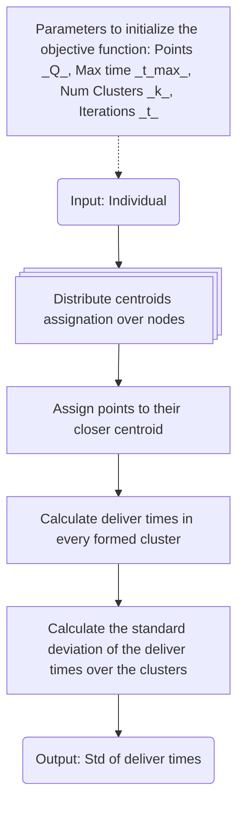
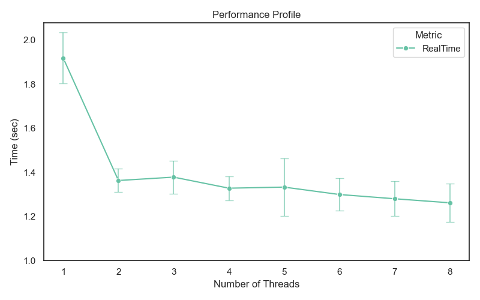
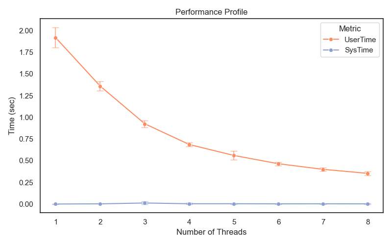
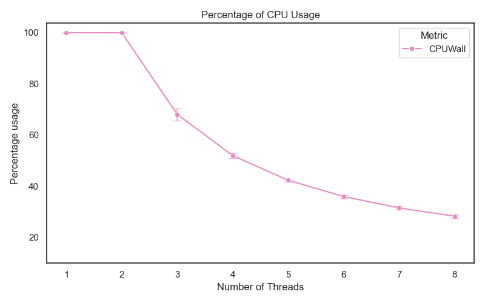

# A Parallelized Objective Function for Delivery Logistic Problem <!-- omit in toc -->

---
## Table of Contents <!-- omit in toc -->
- [Abstract](#abstract)
- [Author, Affiliation and Contact](#author-affiliation-and-contact)
- [General Aim](#general-aim)
- [Context](#context)
- [Problem](#problem)
- [Methodology](#methodology)
  - [Objective Function](#objective-function)
  - [Technologies and Tools](#technologies-and-tools)
  - [Experimental Design](#experimental-design)
- [Installation and Usage](#installation-and-usage)
- [Experiments](#experiments)
- [Analysis of Results](#analysis-of-results)
- [License](#license)
- [References](#references)

---
## Abstract
This repository presents a parallelized implementation of an objective function designed to evaluate cluster balance within the context of the Delivery Logistics Problem. Leveraging parallel processing via Intel MPI and C, the core objective function computes geometric allocations based on the Haversine metric and evaluates cost variances across generated clusters. Performance testing was carried out on a self-hosted cluster of 8 AWS t3.micro instances using a Network File System (NFS) under an experimental design with a dataset of 42,543 coordinates, showing that the system successfully accelerates iteration times for large solution populations. However, experimental performance profiles reveal a scalability bottleneck where employing more than 7 distributed threads yields negligible returns.

---
## Author, Affiliation and Contact
Alexis Aguilar [Student of Bachelor's Degree in "Tecnologías para la Información en Ciencias" at Universidad Nacional Autónoma de México [UNAM](https://www.unam.mx/)]: alexis.uaguilaru@gmail.com

Project developed for the subjects "High-Performance Computing (HPC)" and "Evolutionary Computation" taught in semestre 2026-2.

---
## General Aim
Develop an parallelized objective function based on flatten centroids representation for comparing results in [An algorithm to compute time-balanced clusters for the delivery logistics problem](https://doi.org/10.1016/j.engappai.2022.104795) with [Differential Evolution](https://link.springer.com/article/10.1023/a:1008202821328) and [Genetic Algorithm](https://books.google.com.mx/books?id=5EgGaBkwvWcC&lpg=PR7&ots=mKmq2YMnxo&dq=Adaptation%20in%20Natural%20and%20Artificial%20Systems&lr&pg=PR5#v=onepage&q&f=false) metaheuristics.

---
## Context
The distribution of goods across a geographic region constitutes the primary challenge for many logistics companies, as they consistently seek to reduce costs and delivery times while complying with labor regulations concerning employee workloads. Consequently, the development of optimal delivery routes has become a central issue of significant real-world relevance, aligning with the growth of commercial enterprises that increasingly require greater delivery efficiency (Menchaca-Méndez et al., 2022, p. 1).

---
## Problem
"A company expects to organize deliveries to a set $Q$ of points across a city and has the constraint of assigning an equivalent number of working hours to each worker. Thus, the sale points must be organized in disjoint routes that, considering travel and delivery times, allow the drivers to work approximately the same number of hours and not exceed the time $t_{max}$ specified in their contract. Moreover, each route must correspond to a well-defined city area, with no intersection between the different zones." (Menchaca-Méndez et al., 2022, p. 1).

---
## Methodology
We propose to find the optimal centroids which form well-defined, time-balanced clusters using population-based metaheuristics for continuos spaces. For this project, we are only developing the objective function for the optimization problem and the results comparison between metaheuristics will be done in another project.

### Objective Function
For this optimization problem, we propose an objective function that assigns every point in $Q$ to its closer centroid $C$ based on haversine metric and return the standard deviation of the deliver times of the formed clusters.  

Each solution is a list of centroids of size $(k,D)$ where $k$ is the number of clusters to form and $D$ are the dimensions or features of each point, which to be flattened generates a individual of size $kD$. This representation is the expected input of the objective function, which general algorithmic flow with distributed processing is the next:



### Technologies and Tools
- C
- Intel MPI
- Python

### Experimental Design
The compiled code was executed 100 times using a solution of 480 centroids (latitude and longitude points) and a test dataset of 42,543 points, evaluating the objective function across 1 to 8 parallel processing threads.

The experiments were conducted on a self-hosted cluster of 8 AWS t3.micro instances, utilizing a Network File System (NFS) to share the datasets across nodes.

To determine the real, user, and system times of the execution across the different experiments, timers were placed at critical parts of the code after the data was loaded into RAM. Specifically, a timestamp was recorded immediately after data loading and another after evaluating the objective function based on the costs of each cluster.

---
## Installation and Usage
To use the proposed code, follow these instructions:
1. Clone the repository:
```bash
git clone https://github.com/alexisuaguilaru/DeliveryLogisticProblem.git
```
2. Compile the source code:
```bash
make 
```
3. Execute the code using the following signature:
```bash
mpiexec.hydra -n <NODES> ./LogisticDelivery -i <POINTS_DATASET> -s <SOLUTION_FILE> -o <RESULTS_FILE> -k <NUM_CLUSTERS> -l <MAX_LOAD> -p <PENALIZATION>

mpiexec.hydra -n 4 ./LogisticDelivery -i data/points.csv -s data/solution.csv -o  results -k 4 -l 144000 -p 1
```

---
## Experiments
Following the [Experimental Design](#experimental-design), the following results were obtained, gathering the real, user, and system time metrics, as well as the CPU/Wall ratio from the experimental runs:




---
## Analysis of Results
From the experiments, it can be observed that employing more than 7 distributed processing threads does not yield a significant reduction in execution time. Based on the plots, it can be determined that the objective function benefits from parallelization, thereby reducing the execution time of the iterations when handling a large population of solutions.

---
## License
Project licensed under GNU GPL v3.0.

---
## References
1. Holland, J. H. (1992). Adaptation in natural and artificial systems: an introductory analysis with applications to biology, control, and artificial intelligence. MIT press.
2. Menchaca-Méndez, A., Montero, E., Flores-Garrido, M., & Miguel-Antonio, L. (2022). An algorithm to compute time-balanced clusters for the delivery logistics problem. Engineering Applications of Artificial Intelligence, 111, 104795. https://doi.org/https://doi.org/10.1016/j.engappai.2022.104795
3. Storn, R., & Price, K. (1997). Differential evolution–a simple and efficient heuristic for global optimization over continuous spaces. Journal of global optimization, 11 (4), 341-359.